# Coins and Traitors
This is a multi-agent reinforcement learning environment with both cooperative and competitive elements which I created as a university project.
The general idea is to train agents to play a game of asymmetric information. This game is similar to popular party games such as [Among Us](https://en.wikipedia.org/wiki/Among_Us) or [Mafia](https://en.wikipedia.org/wiki/Mafia_(party_game)).

The implementation uses the [RLlib framework](https://docs.ray.io/en/master/rllib.html). This environment can be used to benchmark new algorithms or neural network structures. 

## Getting started
1. Install the required packages from the `requirements.txt`
2. For GPU support, install the required SDKs (e.g. https://www.tensorflow.org/install/gpu)
3. Train a policy via the `train_coins_traitors_voting.py` script
4. Analyze output metrics with the `analysis.ipynb` Jupyter Notebook or run and render episodes via the `train_coins_traitors_voting.py` script by calling the `test()` function in the main block. (Make sure to change the paths to the corresponding files)

## Game/Environment Description
Many parameters/mechanics are customizable. See the chapter [Configuration](#configuration) for more info

### General
The game takes place in a gridworld. Agents are placed at random positions at the beginning of a round. Agents cannot see the entire map; they only see the cells around them in a specified range.

Similar to other asymmetric games, there are two teams. The innocents and the traitors. The traitors know who the other traitors are. The innocents don't know which team other agents belong to. To overcome this disadvantage, the innocent team is larger.

The innocents have two goals. The first goal is to fulfill a task, in this case collect coins which are randomly scattered around the world. The second is to find out who the traitors are.

The traitors' goal is to prevent the innocents from collecting the coins by breaking coins while not being detected as traitors.
A key game mechanic is that agents can remove other agents from the game for that round. 
Agents share the same reward depending on which team they are in. For example, if one innocent collects a coin, all agents receive a reward (innocents positive and traitors negative). If an innocent is removed, all innocents get the punishment, all traitors get the reward. These rewards can be configured, see [Configuration](#configuration)

### Collecting and breaking coins
When innocents move over a cell containing a coin the coin is automatically collected and disappears from the map.
When traitors move over a cell containing a coin the coin is automatically broken and is replaced with a broken coin. This broken coin has a freshness value indicating how long ago it was broken. Broken coins are still visible to both teams; however, they cannot be interacted with anymore (they can't be collected anymore).

### Removing other agents
There are currently two mechanisms for removing agents. The primary way is through voting. An alternative way, attacking, can also be used.
#### Voting
Each round all agents indicate who they vote for. Agents can vote for as many agents (even for themselves) as the want to each round. If an agent votes to remove another agent, this vote will be stuck for a set number of rounds indicated by the configuration parameter `sticky_votes`. I.e., even if the agent doesn't vote for the other agent anymore the next round, the vote will stay until the set number of rounds is up. (The time is reset if the vote is set again)

#### Attacking
Innocents can attack other agents within a range. If they attack an agent, that agent is immediately removed from the game. 
(Note: Traitors cannot currently attack, this is to make the game more balanced but might be interesting to explore in the future, see [Future Work](#future-work))

### Expected learned behavior
The innocents try to collect the coins as fast as possible. The traitors try to destroy coins without being seen. If an innocent sees a traitor breaking a coin, they vote for the traitor. Traitors try to trick innocents into voting for other innocents. Traitors should not vote for traitors unless in very sophisticated strategies where traitors might try to gain trust of other innocents.

## Configuration
There are many different configuration parameters which can completely change game mechanics or balancing. Note that some combinations might be invalid and that some settings disable the effect of others.

These settings apply to the main `CoinsTraitorsVoting` environment.

- num_agents: The number of agents, in total.
- num_traitors: The number of agents which should be traitors. num_traitors must be less than num_agents and should be less than half of total number of agents for correct balancing.
- num_coins: How many coins to spawn at the beginning of the episode.
- view_ranges: View ranges given for innocents and traitors respectively. This is the radius of the view. So total observable size will be `2*view_range + 1` for both axes.
- agent_removal: Can be 'voting' or 'attacking'. The way which agent removal works. 'voting' was mainly tested.
- observable_votes: If agents can see the votes.
- horizon: After how many timesteps the episode is ended.
- sticky_votes: How long a True vote should stay stuck at True. I.e., if an agent votes for another agent in timestep 1, but not in the `sticky_votes` next timesteps, then the vote gets reset.
- vote_majority_only_alive: How to determine the majority for voting. Only take into account alive agents or also removed agents.
- reset_removed_agents_votes: If the votes of a removed agent should be reset to all False (not taken into acount anymore) or should be kept
- disable_self_votes: If an agent should not be able to vote for themselves. Setting this to True can make learning easier and more stable
- rewards: The rewards given to the agents. Configured for innocents and traitors respectively
    - per_timestep: Punishment each timestep. Usually this is some small negative value for innocents to make them collect coins quickly
    - collect_coin: Reward when a coin is collected. Should be positive for innocents, negative for traitors
    - break_coin: Reward when a coin is broken. Should be negative for innocents, positive for traitors
    - remove_innocent: Reward when an innocent is removed. Should be negative for innocents, positive for traitors
    - remove_traitor: Reward when a traitor is removed. Should be positive for innocents, negative for traitors

## Architecture / Internal Workings
### Files / Structure
There are 3 different environments. They all inherit from the Gridworld Env.

These different environments come from the prototyping nature of this project. `CoinsTraitorsVoting` in `coins_traitors_voting.py` is the main environment which is talked about in the documentation and testing. The two other environments are legacy environments but can be used as starting points for new development.

`coins_easy.py` (legacy) is a simple environment in which agents have to collect coins with limited visibility. It can be used as a first benchmark to see how well agents learn this task.

`coins_traitors.py` (legacy) introduces traitors which can destroy the coins. Innocents get an attacking ability. This is to see if agents can generally learn how to interact with other agents. I.e., innocents need to learn not to attack others without a reason, only if they break coins. And traitors should learn to not get caught breaking coins. This environment also has a setting to disable observable IDs. This can be one way of implementing the agent "tracing" mentioned in [Future Work](#future-work).

`coins_traitors_voting.py` is the main environment which is tested. The environment has coins, innocents, traitors and a voting mechanic. Agents can send a vector of who they want to vote for in each round. This environment allows for the most complex strategies. For example, traitors could vote against other traitors to gain trust of innocents or innocents could recognize that an agent votes for others seemingly without reason and therefore believe they are a traitor. 

For simplicity/consistency, we mainly work with the internal ID throughout the code. Whenever we read the actions or output the observations, however, we must map the observed IDs to internal IDs / map the internal IDs to observed IDs.

### Observable IDs / Voting
Internally, every agent has a fixed ID starting from 0. All agents with an ID less than the number of traitors are a traitor. For example, if there are 5 agents and 2 of them are traitors. The traitors will have the IDs 0 and 1.
This ID cannot be given to other agents of course, otherwise it would be trivial to learn which agents are always the traitors. Therefore, there is an observable ID, which changes each episode.
For this, the `observable_id_assignment` is initialized with a random assignment each round. E.g. for `{0: 2, 1: 0, 2: 1}` the agent with internal ID 0 is visible to others as 2 and so on.

### Model
When agents see other agents via their IDs, it is necessary to not learn something for that specific ID, but in general. It is therefore extremely important that the model is equivariant under permutation of agents. 

There are multiple models provided. The model `perm_equivariant.py` achieves this equivariance by only applying permutation equivariant operations to the inputs. These operations are convolutions with kernel size 1 along the agent dimension, pooling operations along the agent dimension and broadcast summing.
The structure of this model can be seen in the image below. 

`W` indicates the world size, `w` indicates a reduced world size, `P` indicates the number of agents. Channels and Batches are not represented.
The `w` dimension is obtained by pooling over a `W` dimension, but not reducing it to size 1. This is done so that the model size is reduced, as it grows quadratically with the size of `W`, while also making sure that no important spatial features are lost before combining with other features. The model in `perm_equivariant.py` doesn't do this early pooling, which leads to a much larger model and slower training.

All features are summed up in one `PxPxwxw` tensor. Since there exist no 4D pooling operations in PyTorch, the pooling after this sum is implemented via the `torch.max()` and `torch.mean()` functions. This is possible as we aggregate over the entire dimension.
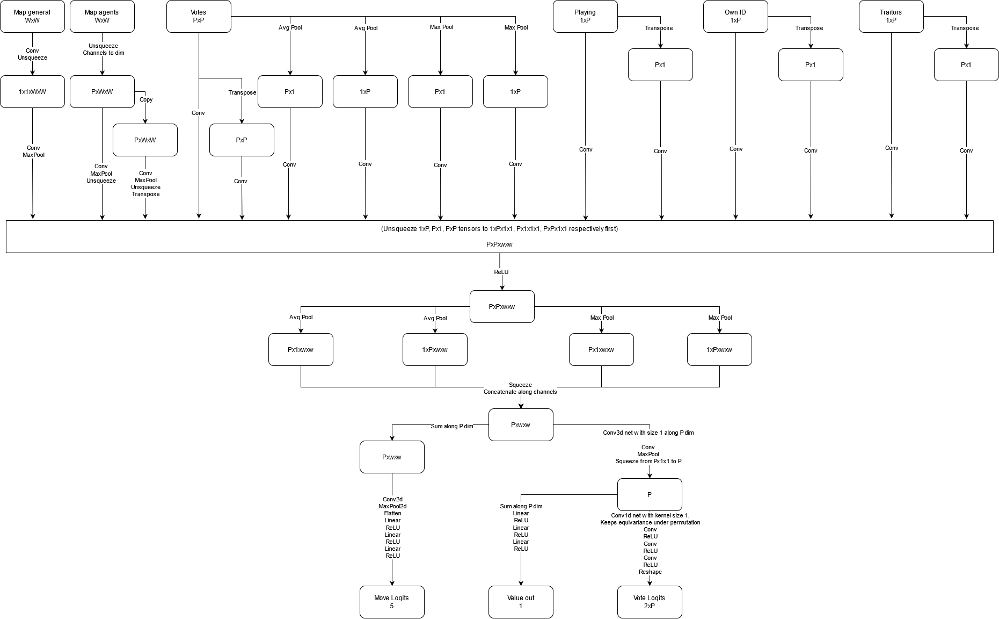

There are also other models provided which only have permutational equivariance to some degree, however, they can be good starting points for new model structures, as some key concepts can be reused, especially for the compatibility with RLlib and for getting started with Keras models.
E.g., `custom_model.py` and `custom_model2.py` achieve permutational equivariance by sharing layers. `custom_model3.py` and `custom_model3_pytorch.py` achieve permutational equivariance by pushing the `P` dimension into the batch dimension and then unbatching this later.

### Training / Testing
Each environment has a corresponding `_train.py` file. E.g., `python train_coins_traitors_voting.py` trains the `CoinsTraitorsVoting` environment. In the training file withing the main block either the `train()` or `test()` method is called. For testing a policy, make sure to call the test method and point to the correct file containing the policy information.

## Future Work
Also see the [Results](#results) to see what might be interesting to explore further.
### Experimenting with current mechanics
These experiments can be run by tweaking configuration settings and only need slight code changes (if at all)
- Number of agents / traitors
- Balancing of rewards / punishments
- View ranges, e.g., traitors can see more than innocents
- Number of coins
- Different broken coin freshness decay functions
- Map layouts (wall collision must be implemented, currently only implemented for map border walls)
- Different RL Algorithms (already implemented in RLlib). Also have different algorithms compete against each other. E.g., algorithm A for innocents and B for traitors.

### New mechanics
These are things which generally need to be implemented and are not possible with current configurations
- Communication channels between agents. Broadcast (public) and One-To-One or Team-wise (private)
- Different styles of voting. E.g., it can be seen how many agents voted for an agent but not who
- Indicating when votes were made
- Agent 'tracing': the agents don't have an ID anymore. Therefore, agents must learn to trace others between timesteps. (In this variant voting like it is implemented now is not possible of course because agents cannot vote for a specific ID)
- Models with [multi-step relational reasoning](https://arxiv.org/abs/1711.08028)
- Models making use of rotational symmetry like [e2cnn](https://github.com/QUVA-Lab/e2cnn)
- Models with memory / taking into account information of prior timesteps (e.g. with LSTM)
- Only train one team while keeping the other static (more stable training / adapting to the other team's strategy is possible more easily)
- Allow attacking and voting in the same round / allow (only) traitors to attack - similar to Among Us
- Hybrid of attacking and voting: instead of removing an agent immediately by attacking, an attack just adds one vote. This can be understood like space confined voting
- More tasks than just breaking coins (like Among Us)

## Results
Run data from an experiment is provided in the `data` directory. Three runs were done with the same parameters: 3 agents, 1 of them being a traitor and sticky votes of 100. I.e., votes cannot be taken back. Full parameters are provided in the `params.json` files.
Note: The version displayed here allowed agents to walk through each other. This is not the case anymore. 

Interestingly, even though the configuration was completely the same for all 3 runs, the learning progressed very differently.

We analyze some interesting points during training by rendering them. In the following videos the votes are displayed on the left in a 3x3 color matrix. An entry in row `i` and column `j` means that agent `i` voted for agent `j` if the square is green and didn't vote if the square is red. The map is displayed on the right. The agents are numbered from 0 to 2. 0 is always the traitor. The green squares indicate the coins. Red squares represent broken coins with the brightness showing the freshness.

### First run
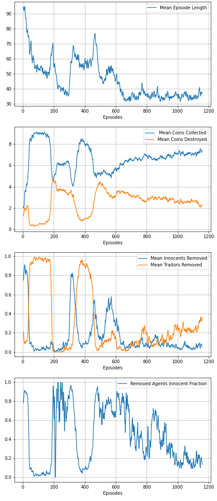

From the comparison of removed innocents to removed traitors we can clearly see that there is no fixed strategy that evolves but multiple strategies that seem to develop as reactions to the other team's strategy. 

#### Episode 100
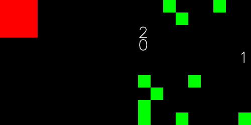

By this point, innocents have clearly gained an advantage. We see that the traitor tries to vote for the other two agents which was probably a good strategy when the innocents were just voting randomly at the beginning. By this point, however, the innocents only vote once another agent has voted. This way they remove the traitor very reliably. After the traitor is gone, they vote for each other. But since there is no vote majority, no one is voted out.

#### Episode 200
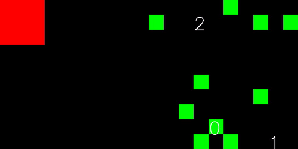

The traitor learns not to vote for the others anymore, the number of agents voted out drops to around 0 for both teams. The focus switches to collecting coins as fast as possible

#### Episode 300
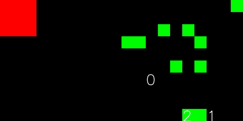

There is a sudden spike in removed innocents around the 300th episode mark. It is not entirely clear what happens here. It seems that the traitor once again votes for innocents which do not retaliate but instead seemingly vote at random.

#### Episode 400
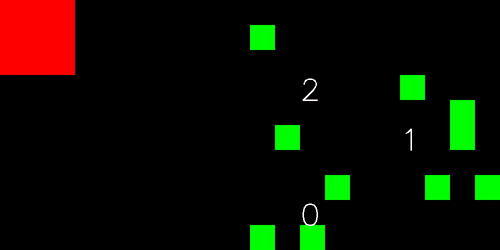

A similar strategy to Episode 100 emerges where the traitor tries to vote out innocents, but the innocents notice this and vote out the traitor instead. The length of this period is somewhat shorter this time.

#### Episode 500
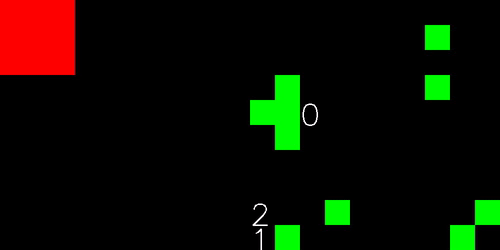

Voting has reduced again and the focus is back to collecting coins.

#### Episode 1150
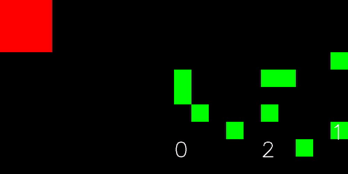

We observe a couple more spikes of the removed agents' values up to Episode 1150. By this point once again the focus lies on collecting coins at which the agents have become quite efficient. The training was stopped here due to time constraints.

### Second run
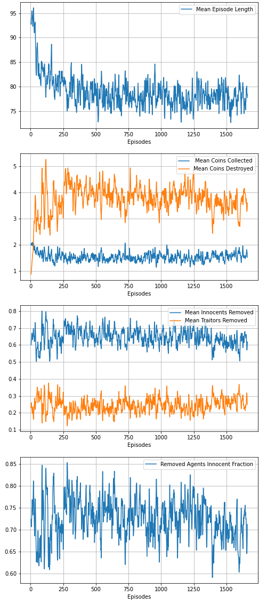

Quite interestingly, we do not observe a clear strategy for either team. The learning is extremely noisy but it seems that the traitor gains the upper-hand. One plausible explanation is that neither agents get a clear learning signal because the environment seems to be very stochastic. Since the agents cannot observe the entire map, it is unclear to them why they might gain a reward for collecting a coin in one timestep, if it was collected by another agent in the same team. 

### Third run
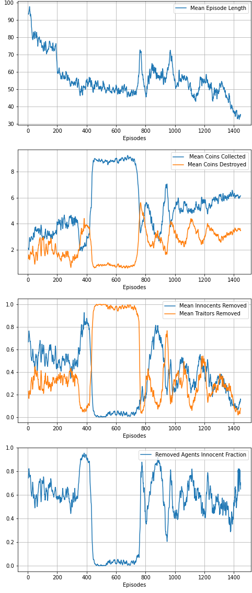

Like in run 1, we observe different strategies that evolve over time and depend on the adaptation to the opponent's playing style.

#### Episode 200 
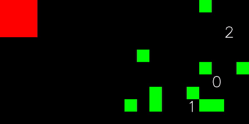

Only the first few timesteps are shown in the video.

Starts off balanced but without clear strategy, votes are random.

#### Episode 400 
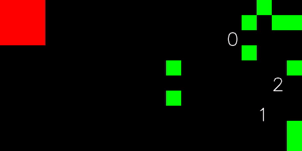

Only the first few timesteps are shown in the video.

The traitor takes advantage of the random votes and always votes for both innocents.

#### Episode 600 
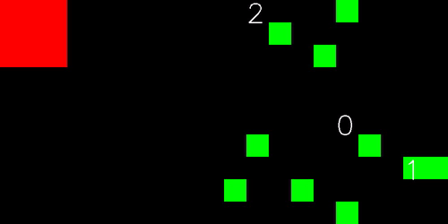

Innocents quickly adapt, the don't vote without a reason anymore. Instead, the vote out anyone who votes, which accurately removes the traitor.

#### Episode 750 
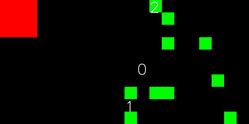

The traitor doesn't vote anymore. The focus goes towards collecting coins as quickly as possible

#### Episode 1400 
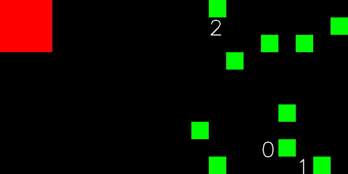

There are a couple more spikes up to episode 1400. At this point the agents have learned to quickly collect coins.

### Experiments with 5 agents
Experiments with 5 agents, 2 of them being traitors, have been made. However, these have shown even more unstable training (similar to run 2). Or showed that the traitors completely dominated indicating that a balance of 6 agents with 2 being traitors might be better. More tests/research is needed in this direction.

### Conclusion
We see multiple different strategies emerge and how agents adapt to the opposite team. It would be interesting to run many experiments in parallel without time constraints to see if even more strategies emerge.
